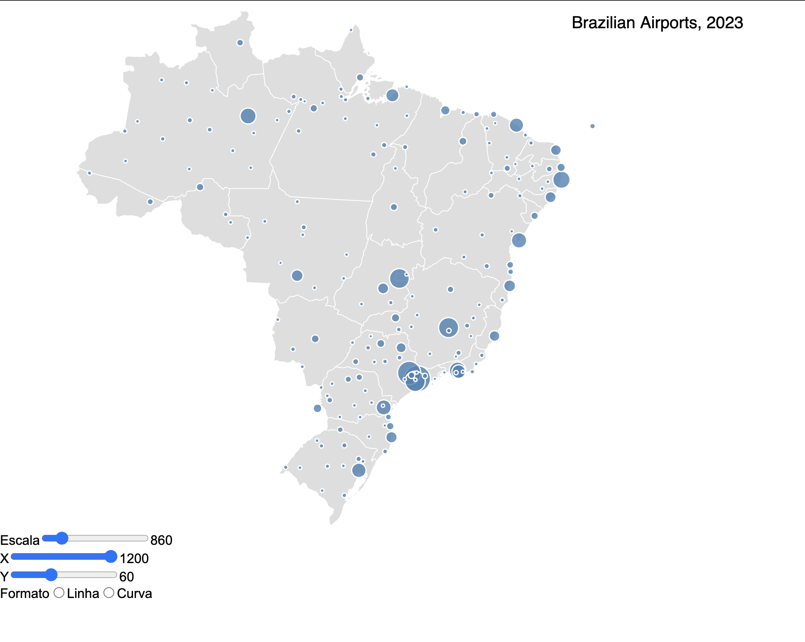

# Interactive Visualization of Brazilian Airports

This project is an interactive visualization of Brazilian airports, showcasing their connections through a graph. The visualization was built using D3.js and VEGA.

## Overview

The goal of this project is to provide a clear and intuitive view of the connections between public Brazilian airports. We used open data from the federal government, as well as information from the Transparency Portal and ANAC (National Civil Aviation Agency), to summarize flights between airports and map their positions and prefixes.

## Features

- **Interactive Visualization:** A graph demonstrating the connections between airports.
- **Detailed Data:** Includes information on the frequency of flights between airports.
- **Geographic Mapping:** Representation of airports on the map with their respective locations.

## Technologies Used

- **D3.js:** JavaScript library for manipulating documents based on data.
- **VEGA:** Declarative language for data visualization.
- **Open Data:** Data from the federal government, Transparency Portal, and ANAC.

## Data Sources

The data used in this project were obtained from:

- [Brazilian Federal Government Open Data](https://dados.gov.br)
- [Transparency Portal](https://www.portaltransparencia.gov.br)
- [ANAC](https://www.anac.gov.br)

## Updating Data

To update the visualization with new data on airports and flights, follow these steps:

1. Locate the folder named `data` within the project directory.
2. Replace the existing files with your new data files. Make sure the new files have the same format as the original ones.
3. Refresh the visualization to see the updated data.

## Contribution

Contributions are welcome! Feel free to open an issue or submit a pull request.

## License

This project is licensed under the [MIT License](LICENSE).

### VEGA License

VEGA is licensed under the following terms:

Copyright (c) 2015-2019, University of Washington Interactive Data Lab
All rights reserved.

# References
https://vega.github.io/vega/tutorials/airports/
https://helpcodenow.com/2019/06/19/chopleth-map-brazil-county-gdp-using-d3-js/
https://luimucar.github.io/choropleth_br_counties/
https://github.com/luimucar/choropleth_br_counties

Enjoy the visualization and contribute to the development of knowledge about Brazilian aviation!
